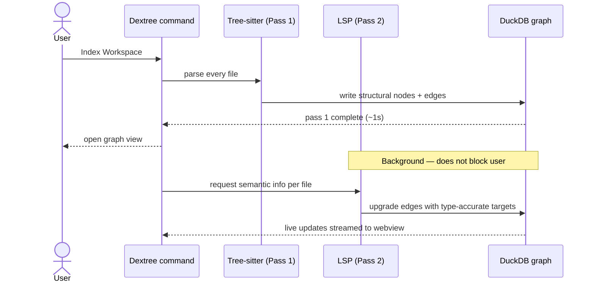

# Two-pass indexing

Dextree uses a **two-pass indexing model** over a single DuckDB graph. Pass 1 makes the graph instantly usable; pass 2 upgrades it to semantic precision in the background.

## The two passes

<ArchDiagram
  id="two-pass-flow"
  next-id="shared-graph-fanout"
  :height="420"
  :nodes="[
    { id: 'src',      label: 'Source files', sub: '*.ts, *.tsx, *.py …', tone: 'cyan',    col: 0, row: 0 },
    { id: 'p1',       label: 'Pass 1',       sub: 'Tree-sitter',         tone: 'amber',   col: 1, row: 0 },
    { id: 'graph',    label: 'DuckDB graph', sub: 'shared substrate',    tone: 'neutral', col: 2, row: 0 },
    { id: 'p2',       label: 'Pass 2',       sub: 'LSP enrichment',      tone: 'rose',    col: 1, row: 1 },
    { id: 'surfaces', label: 'Surfaces',     sub: 'webview · MCP · exporters', tone: 'ok', col: 3, row: 0 },
  ]"
  :edges="[
    { source: 'src',   target: 'p1',       step: 1, animated: true },
    { source: 'p1',    target: 'graph',    step: 2, animated: true },
    { source: 'src',   target: 'p2',       step: 3, dashed: true,  animated: true },
    { source: 'p2',    target: 'graph',    step: 4, dashed: true,  animated: true },
    { source: 'graph', target: 'surfaces', step: 5, animated: true },
  ]"
/>

## Pass 1 — Tree-sitter (instant)

When you run `Dextree: Index Workspace`, Pass 1 parses every file structurally using **Tree-sitter WASM** grammars. It extracts:

- Every symbol (functions, classes, methods, types, variables)
- Every import / export relationship
- File-to-file structural call hints (lexically resolvable calls)

Pass 1 is **deterministic, language-independent at the framework level, and runs in <1 second** for most projects. The graph is immediately usable for navigation, file listing, and structural exports.

Pass 1 is what the [blast radius](#) feature falls back to when LSP is unavailable.

## Pass 2 — LSP enrichment (lazy)

Pass 2 runs **in the background** after Pass 1 finishes. It uses the LSP services VS Code has already initialized to:

- Resolve every call's actual target (handles inheritance, overloads, generics)
- Add type-accurate edges (typed `extends`, `implements`, `returns`)
- Annotate framework hooks (React component boundaries, Vue refs, etc.)
- Cross-reference test discovery (`vscode.tests`)

The graph is **upgraded in place** — surface queries that used Pass 1 edges automatically pick up the more accurate Pass 2 edges as they land. No re-render, no cache invalidation.

::: tip Pass-1 usefulness is sacred
Every Dextree slice spec includes an explicit "Pass 1 usefulness preserved" check. If LSP is unavailable, slow, or returns nothing, the graph still tells you something useful. This is a hard architectural rule, not an aspiration.
:::

## Why two passes instead of one

A naive "wait for LSP and index everything at once" approach would:

- Block the user for 30-60s on a medium repo
- Fail completely when LSP isn't available (think: VS Code without the TypeScript extension installed)
- Re-index on every file change instead of incrementally upgrading

By making Pass 1 the source of truth and Pass 2 an enrichment layer, Dextree stays useful even when the editor's smartest tooling is mid-startup or unavailable.

## Sequence

## Further reading

- [Shared graph](./shared-graph) — why every surface reads the same DuckDB file
- [VS Code data fusion](./vs-code-fusion) — the editor signals Pass 2 can access
